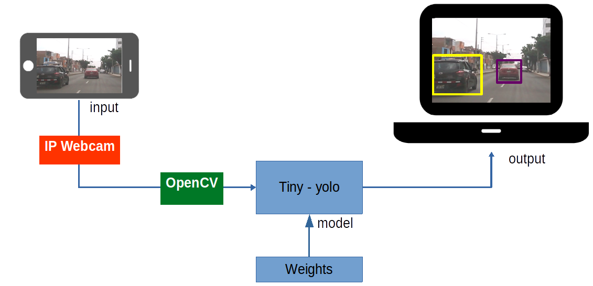
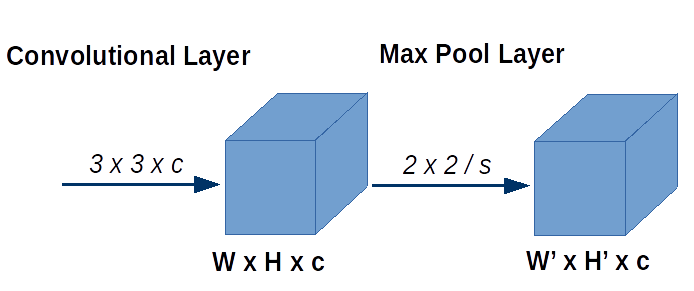
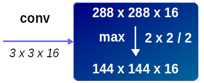
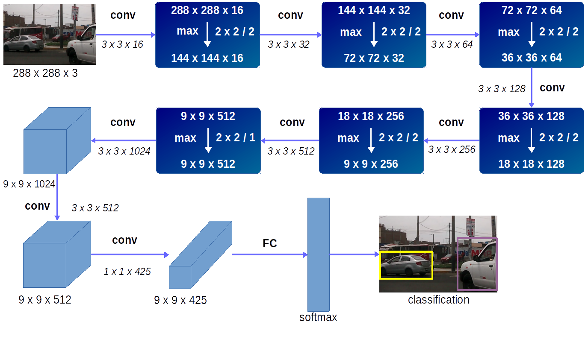

# Introduction

Today there many state of the art neural networks that can achieve atonish results in many domains, in computer vision for example, convolutional neural networks had demostrated to even suprase the accuracy of humans beens, example of such networks are  AlexNet, Inception, ResNet, VGG-16 and many more. Among the many neural netwoks proposed there is one that had proveen to be very efficient detecting many classes in a single images and video as well, this network is called <a href = 'https://arxiv.org/pdf/1506.02640.pdf'> YOLO </a> (You Only Look Once), which is a deep convolutional neural network, capable of classify a wide range of classes including cars, traffic lights, persons, etc., it drawn a box around the classes it detects according with probabilities associated with each class, it is very fast and accurate, and it can be used with pre trained weights or can be trained from scrath with GPU support. YOLO was developed by Joseph Redmon, Santosh Divvala, Ross Girshick and Ali Farhadi in 2016, since then there has been two versions of the YOLO network, the first one, is called <a href = 'https://arxiv.org/pdf/1612.08242.pdf'> YOLO v2 </a>, this version add more general accuracy to the old YOLO, also, and in 2018, a new version arrive called <a href = 'https://pjreddie.com/media/files/papers/YOLOv3.pdf'> YOLO v3 </a>, which add more improvements

# Project Description

In this project I am using a variant of YOLO v2 called Tiny-yolo which I am combining with an android mobile which transfer the input images to the network to made classifications in real time (to be more precisely, the network is tested in a vehicle in motion). Tiny-yolo has a small architecture compared with YOLO and is intended to be less computationally expensive, one downside however is that tiny-yolo is less accurate than YOLO, but it still can achieve great results as we will see in the results.

__Figure 1:__ _Project overview diagram_

The diagram showed in <b> Figure 1 </b> describe the main idea of the project, as we can see, the phone camera is transmiting the images to the network, which is hosted in a laptop, then the network using its trained weights made the classifications in real time. To made this project more interesting we used a vehicle in motion on the road, where the phone camera and laptop were, this allow me to run the network in a real traffic scenario. Now let's take a look more deeply to the components of the project:

* IP Webcam (or similar): This is an app that allows us transmit images or video to the laptop, to do so, it create a server, then the laptop connects to the server, in that way, the laptop have acces to anything that is capture by the phone camera, this app can be found in the [Play Store](https://play.google.com/store/apps/details?id=com.pas.webcam&hl=en) and is free to use.
* openCV: This is a very important one, we need to have installed openCV, it could be difficult to compile, therefore I installed it using a conda package, the version was 3.3.1, openCV will allow us to feed the images from IP Webcam to the network.
* Tiny yolo: We need two components, the network itself and its trained weights, I downloaded the network and compiling using openCV, I used a CPU implementation, next I dowloaded the pre trained weights, the instructions to compile and the weights can be access in the oficial [YOLO web site](https://pjreddie.com/darknet/yolo/).
* Laptop: Where I hosted the tiny yolo, I used a i5-core laptop with 8 GB of ram, using Ubuntu 16.04 LTS. I used Ubuntu because it is more easy to compile yolo that way, but it also can be compiled using other OS.
* Android phone: More important a phone with a camera, I was using one with kitkat 4.4.4 installed, I think we can achieve better results using a more modern phone.
* Car: Well it is optional, but as I said before a real car was used here, notice that I have taken all the security measures, that means that there was a driver which was focussed all the time in the driving, menawhile I was runing the network.
 
# Tiny-yolo architecture

The architecture of tiny yolo is composed of a stack of layers, more concretly it has a convolutional layer follow by a max pooling, in that regard, tiny yolo share its architecture with many state of the art convolutional neural network like AlexNet, Inception etc., where it is usual to stack a block of layers which are specialized in one concrete task like: add more channels, reduce the volume size, etc. In the <b>Figure 2</b> we can observe the main two layers that use tiny yolo.

__Figure 2:__ _Tiny yolo main layers_

__Where:__

*  _C:_ Represents the number of channels in the volumes.
*  _W, H:_ Are the width and height of the volume generated by the convolutional layer.
*  _W’, H’:_ Represent the width and height of the volume generated by the max pooling layer.
*  _s:_ Is the stride used by the pooling layer.
* __Note__: The padding used was 1 in all the layers.

Here we observe a convolutional layer which has a 3 x 3 kernel and a channel <b>C</b>, which is the one that varies along the other convolutional layers, also, there is a max pooling layer, which have a 2 x 2 size and a stride <b>s</b>, which also varies but only in the last layer before to connect with the finals layers. In order to have a more compress representation I had arrange the two main layers (convolutional and max pooling) in a single block as describe in <b>Figure 3</b>.

__Figure 3:__ _Convolutional and max pooling block_

Here we have a convolutional layer <b>(conv)</b> using a 3 x 3 kernel with 16 channels, which results in a 288 x 288 x 16 volume, then it is passed to a max pooling layer <b>(max)</b> with a 2 x 2 size and stride of 2, resulting in a new 144 x 144 x 16 volume, then this volume is passed to the next block of layers. Putting all the blocks together we can finally have the whole architecture used in this project as shown in <b>Figure 4</b>.

__Figure 4:__ _Modify tiny yolo architecture_

In the architecture shown in <b>Figure 4</b> the input size has been modified, the orginal tiny yolo use a 416 x 416 input volume, using this input size I experimented very low frame rates, therefore I decided to low the size to 288 x 288. The architecture is composed by the agrupation of six blocks described in <b>Figure 3</b>; one interesting fact is the channels increment in the convolutional layers, in fact they are increasing by a factor of two, from 16, 32 until 1024 which number of channels corresponding to the last block, in a similar manner the max pooling layer is decreasing the volume along the network, with this two features the network is assuring it have the necessary channels, but at the same time it reduce the volume to be more light. Finally the 1 x 1 kernel which is before the last layer, have the function to connect the convolutional layer with a fully connected softmax layer, which carry on the classification.

# Results
Using the architecture described in the __Figure 4__ I obtained the following results:

# Conclusions

During the test, the results were in the majority accurate, but there was some instances in which the network did some misclassifications, this was expected since as the author said "...it's not perfect, but boy it sure is fast", and indeed it is very fast, morever if we consider that I was using just a CPU implementation.

Now, regarding the misclassified classes, for example, a tree was confused with a road sign, and some objects were recognized as persons, when in fact there were no persons there. I think, two factors may had impacted negativily the accuracy, the camera resolution and the wheater, it was cloudy the day of the test, therefore the images were not so clear as it would be in a sunny day. But despite that the results were good.

Finally I am very sure we can obtain way better results using a GPU and YOLO v3 instead. One last comment in convolutional deep neural networks, they are really awesome, they can achieve great results, and can be applied to a wide range of practical applications, like security, recognition, detection and so on.

# Future Experiments
- I would like to re – train the network adding the images that were misclassified, I think this way the accuracy error could be reduced, for that purpose I think that transfer learning could be an interesting option to explore.
- As I pointed out, this project was made using a CPU implementation, which is not so powerful as a GPU, therefore I think I will  also train the network using a GPU in the future.
- And finally I would like to test this project using [YOLO v3](https://pjreddie.com/media/files/papers/YOLOv3.pdf) which ironically came out just two days after I finished this project.
